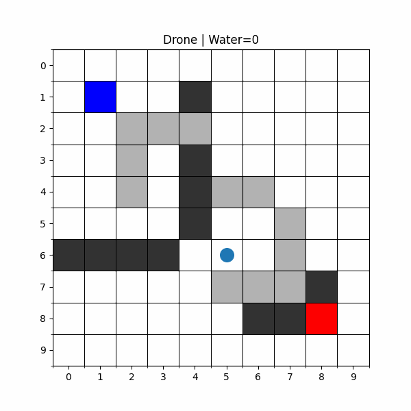
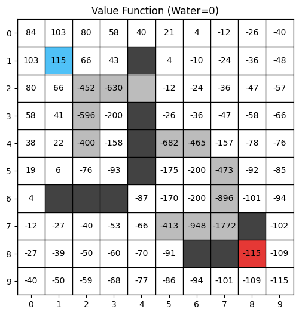
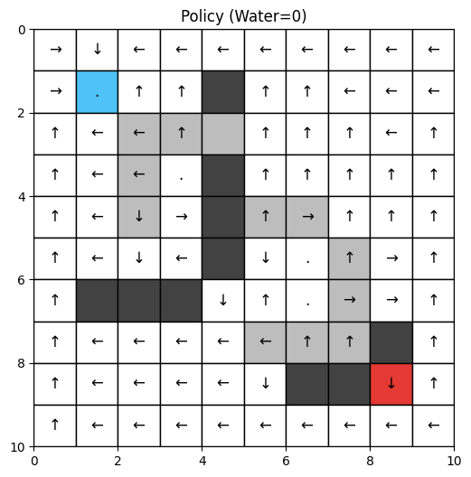

# Fighterfighting Drone: Grid World Navigation Using Value Iteration

## Overview

**Fighterfighting Drone** is a reinforcement learning project that demonstrates the Value Iteration algorithm applied to a practical grid world navigation problem. A drone must navigate a 10×10 grid world filled with obstacles, navigate to an objective marked by fire to extinguish it, and return successfully while avoiding hazards.

## Drone Simulation



## Value Function and Policy Plots

<table>
<tr>
<td></td>
<td></td>
</tr>
<tr>
<td></td>
<td></td>
</tr>
</table>


## What This Project Does

This project implements a complete reinforcement learning pipeline:

- **Environment Simulation**: A realistic grid world with dynamic obstacles including boulders, smoke zones, and landmark locations
- **Value Iteration Algorithm**: Computes optimal state values and policies for the drone to maximize rewards
- **Policy Learning**: Generates an optimal navigation policy that guides the drone's decision-making
- **Visualization**: Displays value functions, learned policies with directional indicators, and animated drone trajectories

The drone must:
1. Navigate to the lake to collect water (enters state with water = 1)
2. Travel to the fire location to extinguish it (only awards reward when carrying water)
3. Optimize the path to maximize total cumulative reward

## Key Features

- **Grid World Environment**: 10×10 grid with multiple obstacle types
  - **Boulders**: Impassable obstacles that block movement
  - **Smoke Zones**: Hazardous areas that reduce movement precision
  - **Lake**: Water source at (1,1) for water collection
  - **Fire**: Target location at (8,8) requiring water to extinguish
  
- **Stochastic Movement**: Realistic motion uncertainty
  - In open areas: 70% intended action, 10% sideways drift, 10% staying still, 10% holding
  - In smoke zones: 40% intended action, 40% staying still, 20% drift (divided equally sideways)

- **Reward System**:
  - **+1000**: Extinguishing fire (reaching fire location with water)
  - **-500**: Entering smoke zones (hazard penalty)
  - **-1000**: Hitting boulders (collision penalty)
  - **-10**: Each step (movement cost)

- **Convergence**: Value Iteration converges using threshold θ = 1e-8 with discount factor γ = 0.95

## Project Structure

```
├── drone_fighter.ipynb          # Main Jupyter notebook with complete implementation
├── Drone Simulation.gif         # Animated demo of drone navigation
├── Policy_Plot_for_Empty_State.png    # Optimal policy visualization (w=0)
├── Policy_Plot_for_Filled_State.png   # Optimal policy visualization (w=1)
├── Value_Function_for_Empty_State.png # State values visualization (w=0)  
├── Value_Function_for_Filled_State.png # State values visualization (w=1)
└── README.md                   
```


## Customization

You can modify the notebook to experiment with different configurations:

- **Grid Size**: Change `grid_size` variable to create larger/smaller environments
- **Reward Values**: Adjust reward function returns for different objectives
- **Discount Factor**: Modify `gamma` (0.95) to change long-term planning preference
- **Convergence Threshold**: Adjust `theta` (1e-8) for faster/more precise convergence
- **Obstacle Placement**: Modify `boulders`, `smoke`, `lake`, and `fire` sets
- **Step Limit**: Adjust `max_steps` in the `simulate()` function
